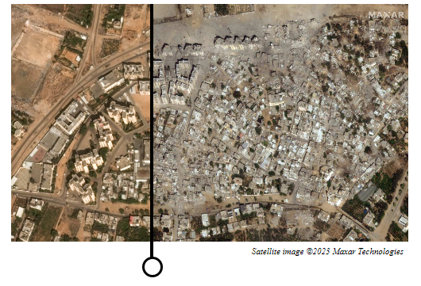

# Image Before and After View library using JavaScript
library for view before and after image.

```
 var obj = new imageCompare('.image-compare',{
        preImage:'assest/img/chapter-3/After_Izbat-Beit-Hanoun_Gaza.jpg',
        afterImage:'assest/img/chapter-3/Before_Izbat-Beit-Hanoun_Gaza.jpg',
        defaultView:24,   // set defalut view in in percantage , defalut value is 50
        caption:'Satellite image ©2023 Maxar Technologies',
        captionStyle:{
            textAlign:'right',
            padding:'6px',
            fontSize:'11px',
            fontWeight:300,
            fontStyle:'italic'
        },
        width:500,
        height:300,
        isDragElementEnable:true,
        dragElementStyle:{
            lineWidth:4, // default is 5
            lineColor:'#000',
            cursorType:'col-resize',
            circleWidth:20,
            circleBackgroundColor:'#fff',
            circleBorderColor:'#000',
            circleBorderWidth:3,
            circleBorderType:'solid'
        },
        style:{
            margin: '0px auto 10rem auto',
            maxWidth: '1024px'
        }

    });
```
## initialize
to initialize, call ```obj.init()``` function.

## get current drag position
```
obj.on('drag-position',function(x,y){
    console.log(x , y)
});
```
## set drag position
```
obj.setDragMove(value)
```
## set default image view
set numeric value betwen 0 to 100 ```defaultView:24```

## Enable drag line 
enable drag line using ```isDragElementEnable:true``` default is false

### set style for view
set any **javascript supported** css property to change style
```
style:{
    margin: '0px auto 10rem auto',
    maxWidth: '1024px'
}
```
## set css for caption

set any **javaScript** css property to change style using ```captionStyle```
```
captionStyle:{
    textAlign:'right',
    padding:'6px',
    fontSize:'11px',
    fontWeight:300,
    fontStyle:'italic'
}
```
## set drag line style property
supported property  ```lineWidth, lineColor, cursorType, circleWidth, circleBackgroundColor, circleBorderColor, circleBorderWidth, circleBorderType```
```
dragElementStyle:{
    lineWidth:4, // default is 5
    lineColor:'#000',
    cursorType:'col-resize',
    circleWidth:20,
    circleBackgroundColor:'#fff',
    circleBorderColor:'#000',
    circleBorderWidth:3,
    circleBorderType:'solid'
}
```


